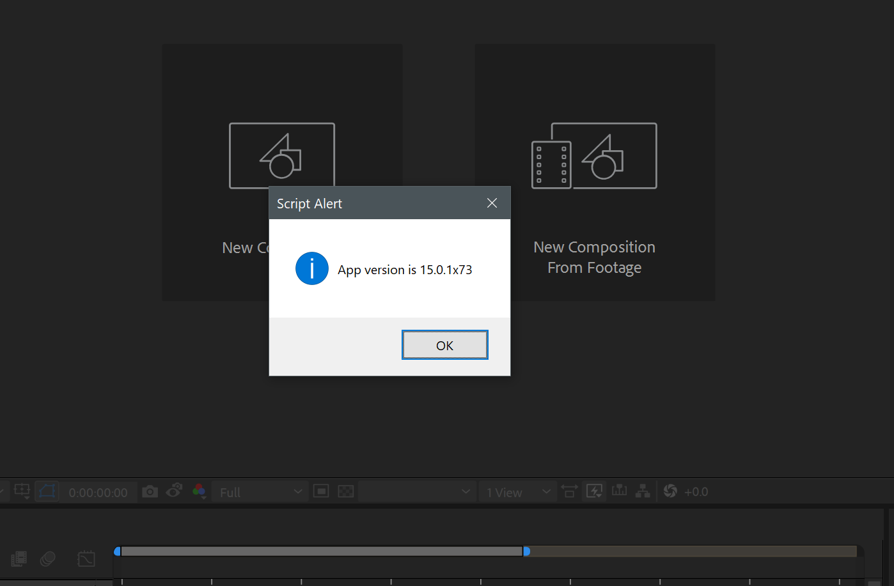
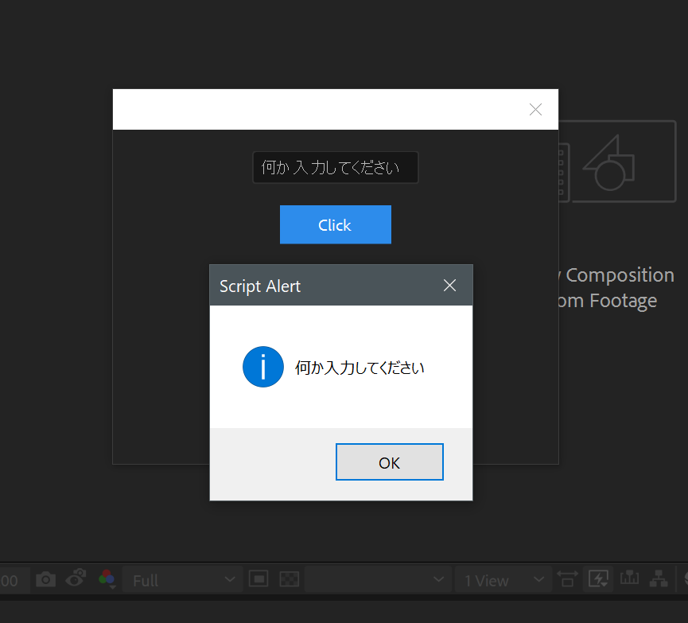

# AfterEffects with TypeScript

[日本語のREADMEはこちら](./README.ja.md)

## Environment
* OS - Windows 10, WSL
* Editor - VSCode
* NodeJS - v8.9.4 (not particularly necessary)
* AfterEffects 2018

## package.json

At a minimum, install the following:

* types-for-adobe: A set of type definitions for use with Photoshop, AfterEffects, etc.
* parcel: A tool that bundles compiled source code. Highly recommended for those who find Webpack cumbersome.

```javascript:package.json
  "devDependencies": {
    "parcel-bundler": "~1.6.1",
    "types-for-adobe": "github:pravdomil/types-for-adobe",
    "typescript": "~2.7.2"
  }
```

## tsconfig.json

tsconfig.json is as follows.
It's pretty standard, with the source in src and the output in dist.

The important parts are:

* target: es3
* noLib: true

Setting the target to es3 is necessary because ExtendScript itself is at the es3 level, and setting noLib to false will cause compilation errors because the application objects do not have actual JS sources.

```javascript:tscofnig.json
{
  "compilerOptions": {
    /* Basic Options */
    "target": "es3",                          /* Specify ECMAScript target version: 'ES3' (default), 'ES5', 'ES2015', 'ES2016', 'ES2017','ES2018' or 'ESNEXT'. */
    "module": "commonjs",                     /* Specify module code generation: 'none', 'commonjs', 'amd', 'system', 'umd', 'es2015', or 'ESNext'. */
    "noLib": true,
    "outDir": "./dist",                        /* Redirect output structure to the directory. */
    "rootDir": "./src",                       /* Specify the root directory of input files. Use to control the output directory structure with --outDir. */

    /* Strict Type-Checking Options */
    "strict": false,                           /* Enable all strict type-checking options. */
    "esModuleInterop": true                   /* Enables emit interoperability between CommonJS and ES Modules via creation of namespace objects for all imports. Implies 'allowSyntheticDefaultImports'. */
 }
}
```

## Let's Show an Alert

Let's try displaying the AfterEffects build name in an alert.
The code looks like this. You can see that code completion works properly.

```typescript:src/app.ts
/// <reference types="types-for-adobe/AfterEffects/2018" />

class Main {
    showBuildname() {
        alert(`App version is ${app.buildName}`);
    }
}

const main = new Main();
main.showBuildname();

```

### Compile & Bundle with Parcel

Although there is currently only one file, I think it will be necessary to have some kind of bundling mechanism after using external libraries like underscore (for various reasons, lodash is not used here) or writing our own modules. Traditionally, I have used Webpack, but setting up the configuration file every time is troublesome, so I decided to try parcel, which seems to be gaining momentum recently.
```
$ ./nodo_modules/.bin/parcel watch src/app.ts
```
Parcel starts a simple HTTP server by default, so I am using the watch option to bundle only.
__app.js__ and __app.map__ were created under dist.

From now on, differential compilation & bundling will be executed automatically every time there is a change in the file. And it's much faster than Webpack.


## Write a Task to Run AfterEffects
The standard way to run scripts is to load and execute them from the AfterEffects menu, but during development, you can't afford to do this every time for trial and error, so I defined a task in VSCode.

```javascript:.vscode/tasks.json
{
    // See https://go.microsoft.com/fwlink/?LinkId=733558
    // for the documentation about the tasks.json format
    "version": "2.0.0",
    "tasks": [
        {
            "label": "Run App script",
            "type": "shell",
            "command": "/mnt/c/Program\\ Files/Adobe/Adobe\\ After\\ Effects\\ CC\\ 2018/Support\\ Files/AfterFX.exe",
            "args": [
                "-r",
                ""${workspaceFolder}\\dist\\app.js""
            ],
            "problemMatcher": [],
        }
    ]
}
```

I am using WSL (formerly BashOnWindows) as the terminal in VSCode, so the path to AfterEffects is /mnt/c..., but please adjust this according to your environment.

Alternatively, there is an extension for VSCode called __AE Script Runner__. This extension allows you to run the script you are currently editing in VSCode in AfterEffects. In this case, since the file is always bundled into __dist/app.js__ by parcel, I defined a task to run this file from anywhere in AfterEffects.

When you run it, an alert should appear like this.



# ES5
ExtendScript is at the es3 level, so there are quite a few things you can't use, such as convenient array methods added in es5. This can be resolved with the ExtendScript-specific es5-shim. __Note that it is not es5-shim__.

Add "extendscript-es5-shim-ts": "~0.0.1" to package.json and run npm install.

```javascript:pacakge.json
  "devDependencies": {
    "parcel-bundler": "~1.6.1",
    "types-for-adobe": "github:pravdomil/types-for-adobe",
    "typescript": "~2.7.2",
    "extendscript-es5-shim-ts": "~0.0.1" // <ー Add
  },
```

In the src/app.ts file, let's try using Array.forEach.
Don't forget to import "extendscript-es5-shim-ts".

```typescript:src/app.ts
/// <reference types="types-for-adobe/AfterEffects/2018" />

import "extendscript-es5-shim-ts";

class Main {
    showBuildname() {
        [1, 2, 3].forEach((x) => {
            alert(`App version is ${app.buildName}( ${x} )`);
        });
    }
}

const main = new Main();
main.showBuildname();

```

## Using Underscore

It might not be necessary, but it's convenient to add it.

__lodash__ did not work due to issues with Object.defineProperty...

```javascript:package.json
  "devDependencies": {
    "parcel-bundler": "~1.6.1",
    "types-for-adobe": "github:pravdomil/types-for-adobe",
    "typescript": "~2.7.2",
    "extendscript-es5-shim-ts": "~0.0.1",
    "underscore": "~1.8.3",         // <- New!!
    "@types/underscore": "1.8.7"    // <- New!!
  },
```

Run npm install, then use underscore in src/app.ts.

```typescript:src/app.ts
/// <reference types="types-for-adobe/AfterEffects/2018" />

import "extendscript-es5-shim-ts";
import _ from "underscore";

class Main {
    showBuildname() {
        _.times(3, (x) => {
            alert(`App version is ${app.buildName}( ${x} )`);
        });
    }
}

const main = new Main();
main.showBuildname();
```

## Using UI Components

As an example of using other AfterEffects, or rather ExtendScript libraries, let's try creating a textbox and a button.

```typescript:src/app.ts
/// <reference types="types-for-adobe/AfterEffects/2018" />

import "extendscript-es5-shim-ts";
import _ from "underscore";
import { UISample } from "./ui_sample";

class Main {
    showSample() {
        const sample = new UISample();
        sample.button.onClick = () => {
            alert(sample.textbox.text);
        }
        sample.show();
    }
}

const main = new Main();
main.showSample();

```



## Conclusion

Using TypeScript and parcel, ExtendScript applications can be written clearly.
I myself am a complete novice with Adobe products, so if there are better ways to do something, please leave a comment!

